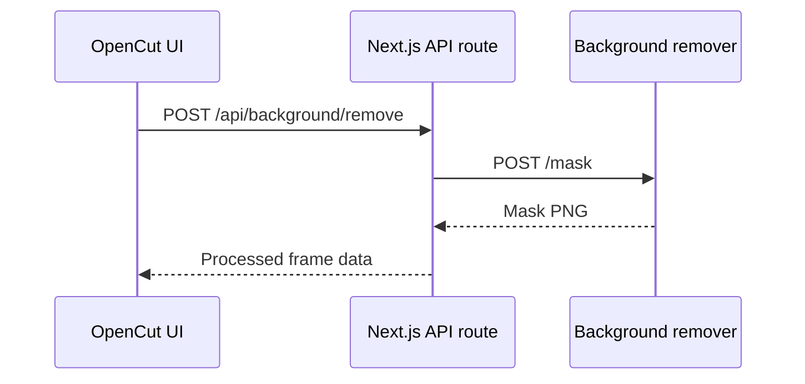

+++
title = "Run the OpenCut Background Remover Locally"
description = "Set up the Python background remover service for OpenCut development."
draft = false
+++

<script type="application/ld+json">
{
  "@context": "https://schema.org",
  "@type": "FAQPage",
  "mainEntity": [{
    "@type": "Question",
    "@id": "https://opencut.dev/faq/opencut-background-remover-local",
    "name": "How do I run the OpenCut background remover locally?",
    "acceptedAnswer": {
      "@type": "Answer",
      "text": "Create a Python virtual environment inside apps/bg-remover, install requirements.txt, configure model paths, and start the FastAPI server so the web app can call http://localhost:8001 for mask generation."
    }
  }]
}
</script>

The background remover ships as a Python FastAPI service alongside the web app.

## Setup

```bash
cd apps/bg-remover
python -m venv .venv
source .venv/bin/activate
pip install -r requirements.txt
```

Download model weights (U^2-Net, SAM) using the provided script:

```bash
python scripts/download_models.py
```

## Run the service

```bash
uvicorn app.main:app --host 0.0.0.0 --port 8001
```

## Configure the web app

`apps/web/.env.local`:

```env
BACKGROUND_REMOVER_URL="http://localhost:8001"
```

Restart `bun dev` so the Next.js API routes use the local endpoint.

## Diagram



Run the service behind `docker-compose` in production to manage dependencies consistently.
