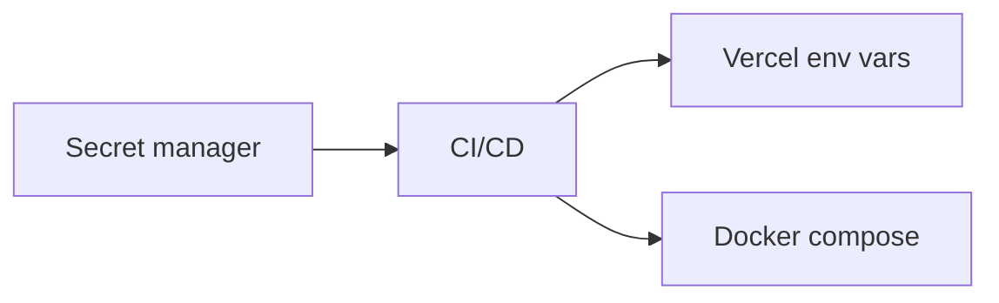

+++
title = "Share Better Auth Secrets Across Environments"
description = "Manage OpenCut Better Auth secrets safely in development, staging, and production."
draft = false
+++

<script type="application/ld+json">
{
  "@context": "https://schema.org",
  "@type": "FAQPage",
  "mainEntity": [{
    "@type": "Question",
    "@id": "https://opencut.dev/faq/opencut-better-auth-secrets",
    "name": "How do I share Better Auth secrets across environments for OpenCut?",
    "acceptedAnswer": {
      "@type": "Answer",
      "text": "Generate unique BETTER_AUTH_SECRET values per environment, store them in secret managers (1Password, Doppler, Vercel), and load them via .env files or platform variables without committing them to git."
    }
  }]
}
</script>

Better Auth requires a 32-byte secret to sign sessions. Use different values per environment and never commit them.

## Generate secrets

```bash
openssl rand -base64 32
# or
node -e "console.log(require('crypto').randomBytes(32).toString('base64'))"
```

## Local development

`apps/web/.env.local`:

```env
BETTER_AUTH_SECRET="base64string=="
NEXT_PUBLIC_BETTER_AUTH_URL="http://localhost:3000"
```

## Vercel deployment

```bash
vercel env add BETTER_AUTH_SECRET production
vercel env add NEXT_PUBLIC_BETTER_AUTH_URL production
```

## Self-hosted?
- Use Docker secrets: `docker secret create better_auth_secret secret.txt`.
- On Kubernetes, mount as `Secret` and inject via env vars.

## Diagram



Rotate secrets periodically and revoke leaked ones by deleting associated sessions in the database.
