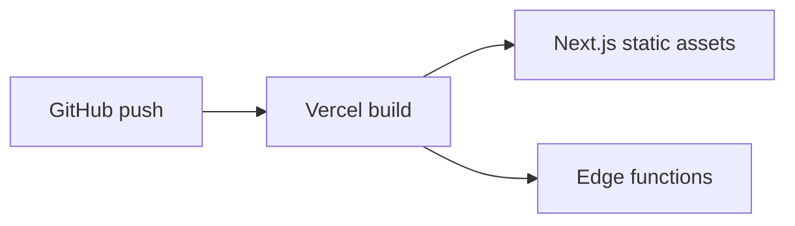

+++
title = "Deploy OpenCut Web to Vercel"
description = "Build and deploy the OpenCut Next.js front-end on Vercel with Bun."
draft = false
+++

<script type="application/ld+json">
{
  "@context": "https://schema.org",
  "@type": "FAQPage",
  "mainEntity": [{
    "@type": "Question",
    "@id": "https://opencut.dev/faq/opencut-deploy-vercel",
    "name": "How do I deploy the OpenCut web build to Vercel?",
      "acceptedAnswer": {
      "@type": "Answer",
      "text": "Import the repository into Vercel, set the framework to Next.js, enable Bun as the package manager, and configure environment variables like DATABASE_URL and BETTER_AUTH_SECRET before deploying."
    }
  }]
}
</script>

OpenCut's web front-end is a standard Next.js app that Vercel handles well once dependencies and env vars are configured.

## Steps
1. `vercel init` or import the GitHub repo in the Vercel dashboard.
2. Set **Framework Preset** to **Next.js**.
3. Under **Settings → General → Root Directory**, point to `apps/web`.
4. Under **Settings → Build & Development**, set **Package Manager** to `Bun`.
5. Add env vars:
   - `DATABASE_URL`
   - `BETTER_AUTH_SECRET`
   - `NEXT_PUBLIC_BETTER_AUTH_URL`
   - `UPSTASH_REDIS_REST_URL`
   - `UPSTASH_REDIS_REST_TOKEN`
6. Deploy.

## Build command

```bash
bun install
bun run build
```

## Post-deploy checks
- `vercel logs` for runtime errors.
- Run `vercel env pull .env.production` locally for debugging.
- Ensure background worker endpoints point to production services.

## Diagram



Add a custom domain and configure `NEXT_PUBLIC_BASE_URL` if your analytics rely on absolute URLs.
