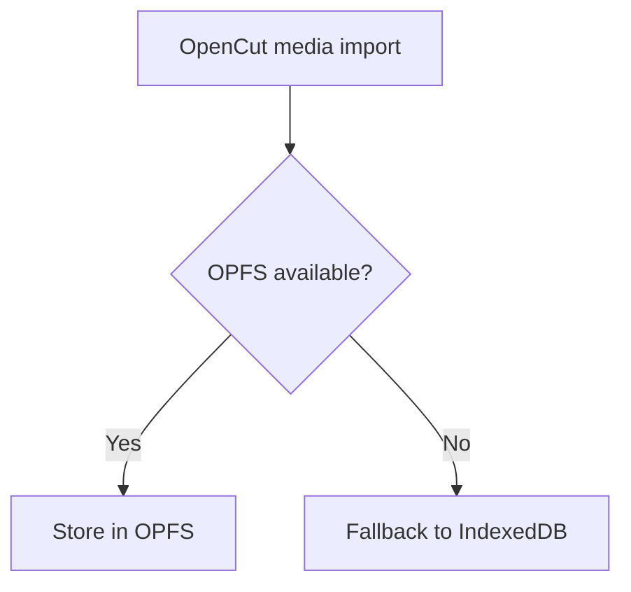

+++
title = "Enable OPFS Media Storage in Safari"
description = "Fix OpenCut's Origin Private File System storage on Safari when media fails to persist."
draft = false
+++

<script type="application/ld+json">
{
  "@context": "https://schema.org",
  "@type": "FAQPage",
  "mainEntity": [{
    "@type": "Question",
    "@id": "https://opencut.dev/faq/opencut-opfs-safari",
    "name": "How do I enable OPFS media storage in Safari for OpenCut?",
    "acceptedAnswer": {
      "@type": "Answer",
      "text": "Enable the Develop > Experimental Features > File System Access API toggle, ensure the page is served over HTTPS, and fall back to IndexedDB when persistent storage is unavailable."
    }
  }]
}
</script>

Safari ships the File System Access API behind experimental flags until macOS 14.4. Without OPFS, large media files fall back to in-memory storage.

## Steps
1. Open **Safari > Settings > Advanced** and check **Show features for web developers**.
2. In the menu bar choose **Develop > Experimental Features > File System Access API**.
3. Reload OpenCut. The browser will prompt for storage access when you import media.
4. Serve OpenCut over `https://` or `http://localhost` so the API is available.

## Fallback strategy

```ts
const fs = await navigator.storage.getDirectory();
// Safari fallback
defaultStorage = window.indexedDB ?? memoryStorage;
```

If `navigator.storage.getDirectory` throws, store media in IndexedDB:

```ts
if (!window.showOpenFilePicker) {
  await mediaStore.enableIndexedDbFallback();
}
```

## Diagram



Communicate the experimental nature of OPFS to QA so they test on production Safari builds.
