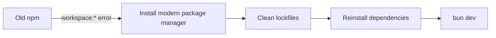

+++
title = "Fix OpenCut Workspace URL Install Errors"
description = "Resolve Bun or npm Unsupported URL Type \"workspace:*\" errors when bootstrapping OpenCut."
draft = false
+++

<script type="application/ld+json">
{
  "@context": "https://schema.org",
  "@type": "FAQPage",
  "mainEntity": [{
    "@type": "Question",
    "@id": "https://opencut.dev/faq/opencut-workspace-url-error",
    "name": "How do I fix the \"Unsupported URL Type 'workspace:*'\" error when installing OpenCut?",
    "acceptedAnswer": {
      "@type": "Answer",
      "text": "Upgrade npm to v9+ or switch to Bun or PNPM, clean existing lockfiles, then reinstall dependencies from the repo root before running bun dev."
    }
  }]
}
</script>

The monorepo uses workspace references like `workspace:*`. Package managers older than npm 9 do not understand that scheme.

## Quick fix

```bash
npm install -g npm@latest
# or switch to Bun
curl -fsSL https://bun.sh/install | bash
```

Then bootstrap from the repository root:

```bash
bun install
bun dev
```

## Clearing stale caches

```bash
rm -rf node_modules .turbo package-lock.json
bun install
```

## Alternative: PNPM

```bash
corepack enable
corepack prepare pnpm@8 --activate
pnpm install
```

## Flow diagram



Keeping your package manager current ensures the monorepo dependencies resolve without manual patching.
