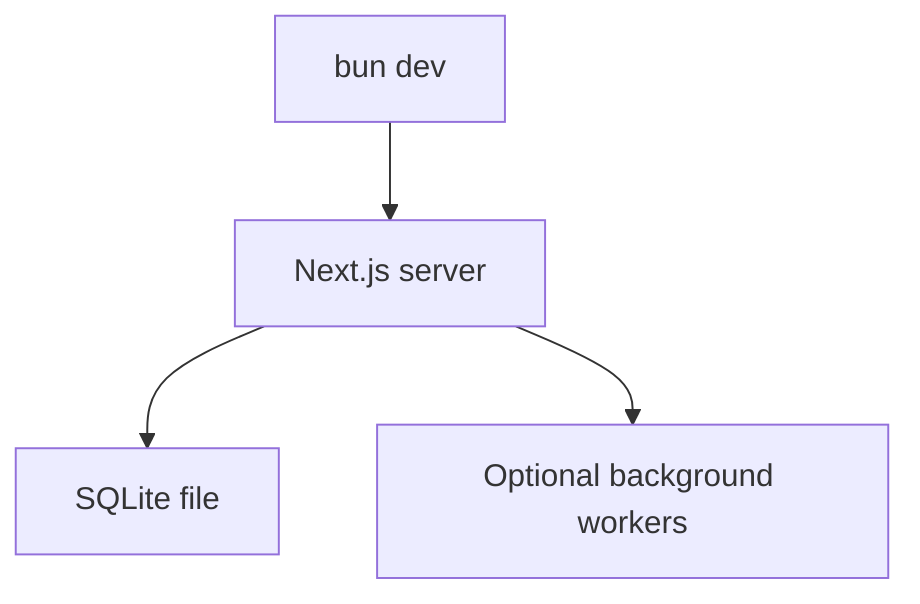

+++
title = "Run OpenCut Web App Without Docker"
description = "Start the OpenCut Next.js app locally without Postgres or Redis containers."
draft = false
+++

<script type="application/ld+json">
{
  "@context": "https://schema.org",
  "@type": "FAQPage",
  "mainEntity": [{
    "@type": "Question",
    "@id": "https://opencut.dev/faq/run-opencut-without-docker",
    "name": "How can I run the OpenCut web app without Docker services?",
    "acceptedAnswer": {
      "@type": "Answer",
      "text": "Copy apps/web/.env.example to .env.local, point DATABASE_URL at a SQLite file, set DISABLE_BACKGROUND_WORKERS=true, then run bun dev without starting docker-compose."
    }
  }]
}
</script>

OpenCut's Docker stack (Postgres + Redis) is optional while you build UI features.

## Minimal .env.local

```bash
cp apps/web/.env.example apps/web/.env.local
```

Edit the file:

```env
DATABASE_URL="file:./dev.db"
UPSTASH_REDIS_REST_URL=""
UPSTASH_REDIS_REST_TOKEN=""
DISABLE_BACKGROUND_WORKERS=true
```

Install dependencies and run:

```bash
cd apps/web
bun install
bun dev
```

## Using SQLite

```bash
bun run db:generate
bun run db:migrate
```

The Drizzle schema will create `dev.db` inside `apps/web`.

## Feature flags
- Disable transcription queue UI while Redis is absent.
- Mock analytics providers by toggling `NEXT_PUBLIC_ENABLE_ANALYTICS=false`.

## Diagram



When you need cloud parity (background removal, transcription queues), re-enable `docker-compose up -d`.
